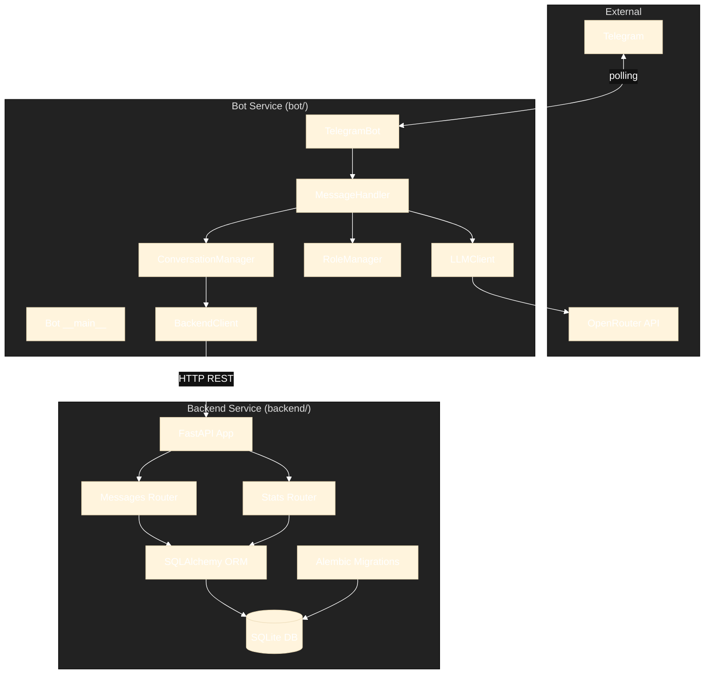

# Обзор архитектуры и структуры

Кратко о компонентах и потоке обработки (текущее состояние после реорганизации).

## Высокоуровневая архитектура

Приложение состоит из двух основных сервисов:

1. **Backend** (`backend/`) - FastAPI REST API с базой данных
2. **Bot** (`bot/`) - Telegram бот, взаимодействующий с backend через HTTP



## Backend Components

### API Layer (`backend/app/`)
- **main.py**: FastAPI application factory, CORS setup
- **routers/messages.py**: CRUD endpoints for messages and conversation history
  - `POST /api/v1/messages` - Create message
  - `GET /api/v1/conversations/{user_id}/messages` - Get history
  - `DELETE /api/v1/conversations/{user_id}/messages` - Clear history
- **routers/stats.py**: Dashboard statistics endpoint
  - `GET /api/v1/stats?period={day|week|month}` - Get statistics
- **schemas/**: Pydantic models for request/response validation
- **collectors/**: Statistics collectors (mock/real implementations)

### Database Layer (`backend/db/`)
- **models.py**: SQLAlchemy ORM models (`Message` table)
- **session.py**: Database session factory and dependency injection

### Migrations (`backend/alembic/`)
- Alembic configuration and version history
- Database schema migrations
- **Database location**: `backend/data/bot.db` (persisted via volume mount)

## Bot Components

### Core Bot (`bot/`)
- **Config**: Reads env vars, provides configuration (including `BACKEND_URL`)
- **BackendClient**: HTTP client for backend API communication
- **ConversationManager**: Uses `BackendClient` to manage history (no direct DB access)
- **RoleManager**: Loads role from file with caching
- **LLMClient**: Calls OpenRouter API for chat completions
- **MessageHandler**: Processes commands and messages, orchestrates flow
- **TelegramBot**: Aiogram `Bot`/`Dispatcher`, handler registration, polling
- **__main__**: Initialization, `.env` loading, startup

## Sequence Diagram: Message Processing


## Communication

### Bot ↔ Backend
- **Protocol**: HTTP/REST over JSON
- **Authentication**: None (trusted local/Docker network)
- **Base URL**: 
  - Local development: `http://localhost:8000`
  - Docker Compose: `http://backend:8000` (service name DNS)
- **Error handling**: HTTP exceptions propagated to bot handlers

### Backend ↔ Database
- **Protocol**: SQLAlchemy async ORM
- **Driver**: `aiosqlite` for async SQLite
- **Connection**: Single database file `backend/data/bot.db`
- **Session management**: FastAPI dependency injection via `get_db()`

## Deployment Architecture

### Docker Compose
```yaml
services:
  backend:
    - Runs FastAPI on port 8000
    - Manages database migrations (alembic upgrade head)
    - Volume mount: ./backend/data (DB persistence)
    
  bot:
    - Depends on backend service
    - Environment: BACKEND_URL=http://backend:8000
    - No direct database access
```

### Data Persistence
- SQLite database file stored on host filesystem: `./backend/data/bot.db`
- Volume mounted into backend container: `/app/backend/data`
- Survives container restarts and rebuilds
- Migrations applied automatically on backend startup

## Design Principles

1. **Separation of Concerns**: Backend owns data, bot owns user interaction
2. **API-First**: All data access through REST API
3. **No Shared State**: Each service independent
4. **Dependency Injection**: SQLAlchemy sessions via FastAPI dependencies
5. **Type Safety**: Full type hints, mypy strict mode
6. **Testability**: Services can be tested independently

## Technology Stack

### Backend
- **Framework**: FastAPI
- **ORM**: SQLAlchemy 2.0 (async)
- **Database**: SQLite with aiosqlite driver
- **Migrations**: Alembic
- **Validation**: Pydantic v2

### Bot
- **Framework**: aiogram 3.x
- **LLM Client**: OpenAI SDK (for OpenRouter)
- **HTTP Client**: httpx (async)
- **Configuration**: python-dotenv

## See Also
- [ADR-011: Backend-Owned Database and REST API](../adr/ADR-011-backend-owned-db-and-rest-api.md)
- [Stats API Guide](./stats-api.md)
- [Codebase Tour](./codebase-tour.md)
- [Configuration and Secrets](./configuration-and-secrets.md)
