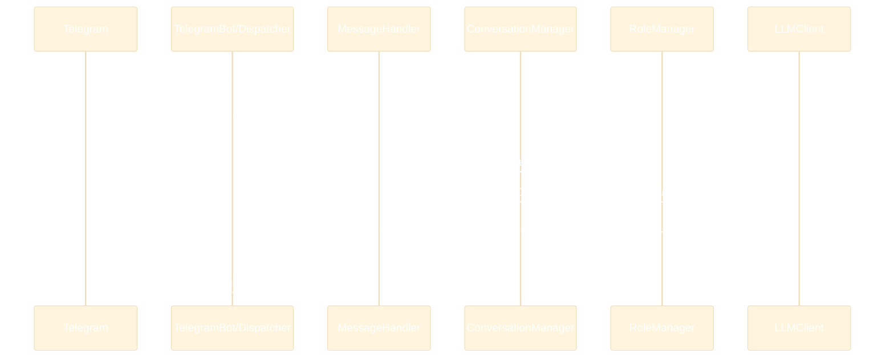

# Обзор архитектуры и структуры

Кратко о компонентах и потоке обработки (текущее состояние).

## Компоненты
- `Config`: читает env, предоставляет параметры (`telegram_bot_token`, `openrouter_*`, `role_prompt_file`).
- `ConversationManager`: in-memory история диалогов per user.
- `RoleManager`: загрузка роли из файла + кэш.
- `LLMClient`: вызовы OpenRouter (OpenAI SDK) для chat completions.
- `MessageHandler`: команды и текстовые сообщения; сбор промпта, вызов LLM, обновление истории.
- `TelegramBot`: aiogram `Bot`/`Dispatcher`, регистрация хендлеров, polling.
- `__main__`: инициализация, загрузка `.env`, запуск.

## Диаграмма компонентов
```mermaid
%%{init: {"theme":"base","themeVariables": {"background":"#000000","primaryTextColor":"#FFFFFF","lineColor":"#FFFFFF","secondaryColor":"#111111","tertiaryColor":"#222222"}}}%%
flowchart LR
    subgraph App[Приложение]
        C[Config]
        R[RoleManager]
        H[MessageHandler]
        CM[ConversationManager]
        L[LLMClient]
        B[TelegramBot]
    end

    C --> R
    C --> L
    R --> H
    CM --> H
    L --> H
    H --> B

    B -. polling .->|aiogram| User[(Telegram)]
    H -->|messages| L
    H <--> CM
```

## Последовательность обработки сообщения


## Структура репозитория (высокоуровнево)
- `src/bot/*` — исходный код.
- `tests/*` — тесты (pytest, pytest-asyncio, coverage).
- `docs/*` — документация (ADR, планы, vision).
- `prompts/*` — роль бота (по умолчанию `role.txt`).
- `Makefile`, `pyproject.toml` — инструменты качества и сборки.

