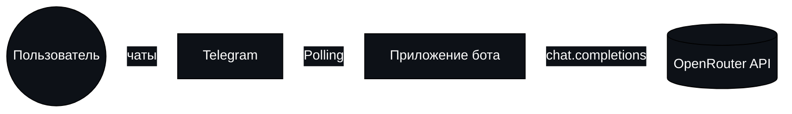
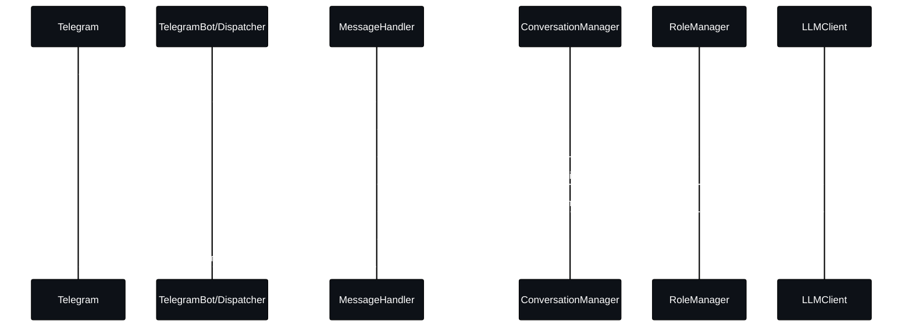
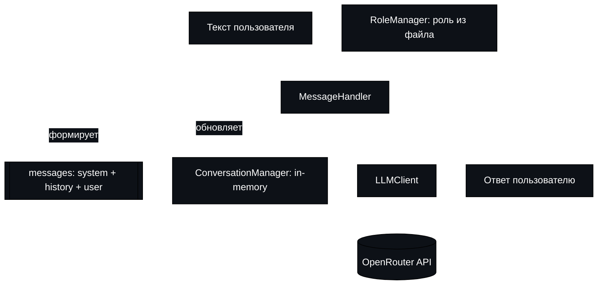
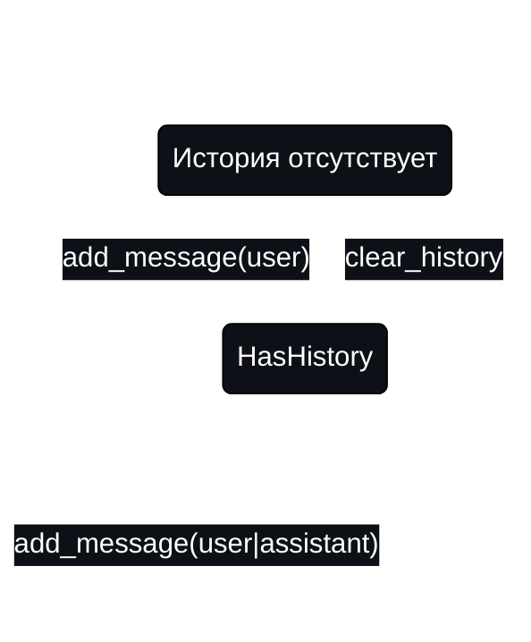
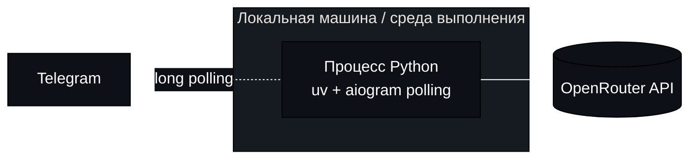
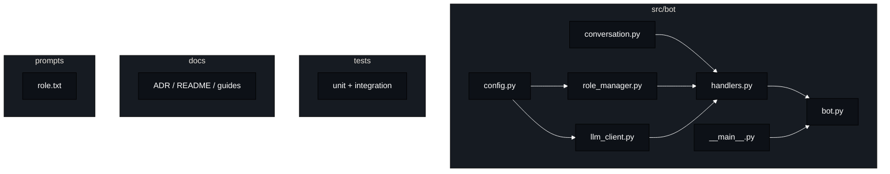

# Визуализации (текущее состояние)

Набор диаграмм с разных точек зрения. Только текущее состояние проекта.

## 1) Контекст системы


## 2) Компоненты приложения
```mermaid
%%{init: {"theme":"base","themeVariables": {"background":"#000000","primaryTextColor":"#FFFFFF","lineColor":"#FFFFFF","secondaryColor":"#0d1117","tertiaryColor":"#161b22","primaryColor":"#0d1117"}}}%%
flowchart LR
  subgraph App[Приложение]
    C[Config]
    R[RoleManager]
    CM[ConversationManager]
    L[LLMClient]
    H[MessageHandler]
    B[TelegramBot]
  end
  C --> R
  C --> L
  R --> H
  CM --> H
  L --> H
  H --> B
  B -. polling .->|aiogram| TG[Telegram]
```

## 3) Последовательность обработки текстового сообщения


## 4) Поток данных


## 5) Состояние диалога (упрощённо)


## 6) Развёртывание (упрощённо)


## 7) Модель данных (логическая, in-memory)
```mermaid
%%{init: {"theme":"base","themeVariables": {"background":"#000000","primaryTextColor":"#FFFFFF","lineColor":"#FFFFFF","secondaryColor":"#0d1117","tertiaryColor":"#161b22","primaryColor":"#0d1117"}}}%%
erDiagram
  USER ||--o{ MESSAGE : has
  CONVERSATION ||--o{ MESSAGE : contains
  USER ||--o{ CONVERSATION : per_user

  USER {
    int id
  }
  CONVERSATION {
    int user_id
    // хранится в памяти процесса
  }
  MESSAGE {
    string role
    string content
  }
```

## 8) Пакеты/файлы (высокоуровнево)


